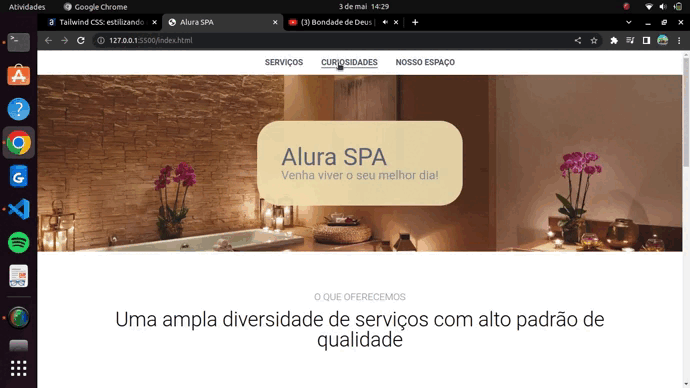

# Alura Cast

Desenvolvimento de uma aplicação frontend com HTML/CSS/Sass. Tendo como principal objetivo simplificar a maneira de escrever com sass através do css.



## Funcionalidades

- Navegação (Menu).
- Serviços.
- Formulário.
- Curiosidades.
- Rodapé.  

## Como utilizar

```bash
# Terminal

git clone https://github.com/MateusMaciel340/alura-spa # clone do repositório

cd aluracast/ # acessando pasta

# acessar Live Server com index.html
```

## Contribuição

Contribuições são bem-vindas! Se você quiser contribuir com este projeto, por favor, abra uma issue para discutir suas ideias ou envie um pull request com suas alterações.

**Desenvolvedor:** Mateus Maciel - @mateusdev340

## Tecnologias:

- HTML
- CSS
- SASS
- SCSS

## Licença

Este projeto é licenciado sob a licença Alura Cursos.